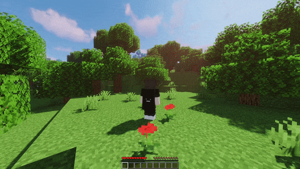
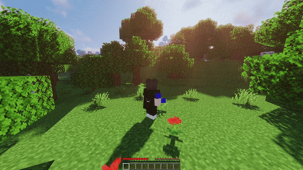

# DoubleJump


[](https://github.com/imDMK/DoubleJump/actions/workflows/gradle.yml)


[](https://www.spigotmc.org/resources/doublejump-1-17-1-20-1.110632/)
[](https://dev.bukkit.org/projects/d-doublejump)
[](https://hangar.papermc.io/imDMK/DoubleJump)
[](https://modrinth.com/plugin/doublejump)
[](https://bstats.org/plugin/bukkit/Double-Jump/19387)

### Information
This is a plugin that allows you to double-jump on the server.
* **Performance-focused** - Minimizes the impact on server resources, allowing you to maintain high server performance.
* **Simplicity of configuration** - Thanks to clear documentation, even people without advanced knowledge can easily adapt the plugin to their own needs.
* **Regularly Updated** - We update our plugin regularly, both fixing bugs and adding new features to ensure full compatibility with the latest versions of the game.

### Features
* Spawn particles when a player executes a double jump,
* Play a sound when a player performs a double jump,
* Double jump streaks,
* Double jump item,
* Option to customize messages (ACTIONBAR, CHAT, etc.),
* Option to disable double jump in selected worlds,
* Option to enable or disable double jump mode for a selected player,
* Option to enable double jump mode upon joining the server,
* Ability to disable double jump in selected game modes,
* Ability to set double jump streaks to reset after death or upon touching the ground.
* [WorldGuard](https://github.com/EngineHub/WorldGuard) support - Ability to disable double jump in selected regions,
* [Adventure components](https://github.com/KyoriPowered/adventure) support.
* [PlaceholderAPI](https://github.com/PlaceholderAPI/PlaceholderAPI) support.
* User-friendly API.

### Preview
* #### Double jumping without delay


* #### Double jumping with delay and streak


### Command permissions
| Command            | Permission              |
|:-------------------|:------------------------|
| `doublejump`       | command.doublejump      |
| `doublejump for`   | command.doublejump.for  |
| `doublejump item`  | command.doublejump.item |

### Placeholder API formats
* `jump-player-delay` - Displays the remaining delay time until the next double jump can be used.
* `jump-player-is-delay` - Returns "yes" or "no" depending on whether the player has a jump delay.
* `jump-player-regeneration-delay` - Shows the remaining time to regenerate one jump in human-readable.
* `jump-player-has-jumps` - Returns "yes" or "no" depending on whether the player has an unused double jump available.
* `jump-player-jumps-limit` - Returns the jump limit value for the player.
* `jump-player-jumps` - Returns the total value of all double jumps performed.
* `jump-player-streak` - Returns the player's current double jump streak.

All placeholders will return null if the player does not have an active double jump (placeholder will not be applied).
  
### Notification types
* `CHAT`
* `ACTIONBAR`
* `TITLE`
* `SUBTITLE`
* `DISABLED`
* 

### Particle spawn error
* The error is because the particle type needs additional data. 
Currently, the plugin supports particle types that contain **no data** or only **DustOptions**. 
[Here](https://hub.spigotmc.org/javadocs/spigot/org/bukkit/Particle.html) you have a list of all (The description indicates the data).

### API
To start using API you have to include a double-jump-API jar to your libraries or use:
#### Maven
```xml
  <repositories>
    <repository>
      <id>jitpack.io</id>
      <url>https://jitpack.io</url>
    </repository>
  </repositories>

  <dependencies>
    <dependency>
      <groupId>com.github.imDMK.DoubleJump</groupId>
      <artifactId>doublejump-api</artifactId>
      <version>VERSION</version>
    </dependency>
  </dependencies>
```
#### Gradle
```groovy
  repositories {
    maven { url 'https://jitpack.io' }
  }

  dependencies {
    implementation 'com.github.imDMK.DoubleJump:doublejump-api:VERSION'
  }
```
#### Usage
After install dependency, you can access the API using:
```java
DoubleJumpApiProvider.get();
```
Example usage:
```java
    @EventHandler
    public void onPlayerChat(AsyncPlayerChatEvent event) {
        Player player = event.getPlayer();
        String message = event.getMessage();

        DoubleJumpApi doubleJumpApi = DoubleJumpApiProvider.get();

        JumpPlayerManager jumpPlayerManager = doubleJumpApi.getJumpPlayerManager();
        JumpPlayerService jumpPlayerService = doubleJumpApi.getJumpPlayerService();

        if (message.equalsIgnoreCase("!testdoublejump")) {
            if (this.jumpPlayerManager.isDoubleJumpMode(player)) {
                return;
            }

            event.setCancelled(true);
            
            this.jumpPlayerService.enable(player, true); //true to skip checking if player can use double jump

            player.sendMessage("Now u can test our double jump plugin!");
        }
    }
```
#### Events
* `DoubleJumpEvent` - Called when the player tries to use a double jump
* `JumpStreakResetEvent` - Called when the player's jump streak will be reset.

Example usage:
```java
    @EventHandler
    public void onPlayerDoubleJump(DoubleJumpEvent event) {
        Player player = event.getPlayer();

        System.out.println(player.getName() + " used double jump.");
    }
    
    @EventHandler
    public void onJumpStreakReset(JumpStreakResetEvent event) {
        Player player = event.getPlayer();
        
        if (player.isOp()) {
            event.setCancelled(true);
            return;
        }
        
        if (event.getResetReason() == JumpStreakResetReason.PLAYER_ON_GROUND) {
            player.teleport(
                new Location(player.getWorld(), 100, 100, 100)
            );
        }
    }
```
### Reporting issues
If you have any suggestions or find a bug, please report it using [this](https://github.com/imDMK/DoubleJump/issues/new/choose) site.

### Support project 
If you would like to appreciate this project you can do so [here](https://www.buymeacoffee.com/imdmk)
