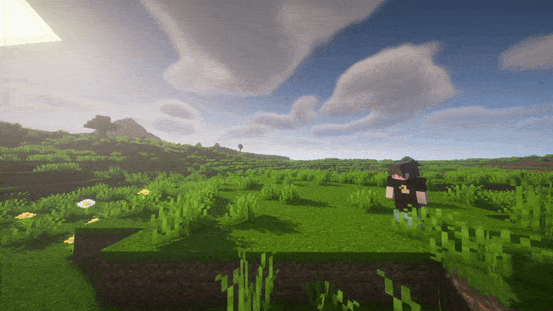
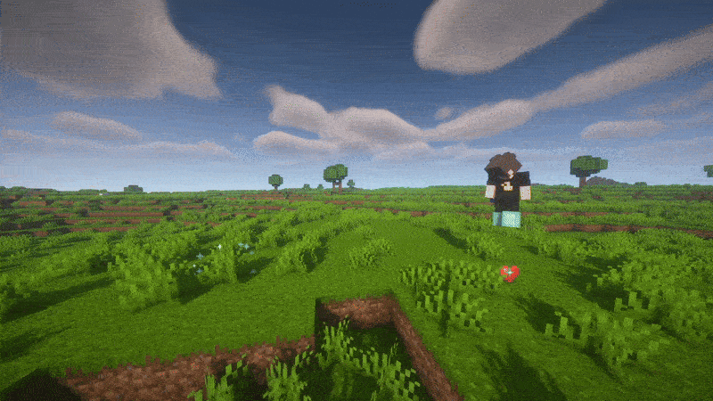
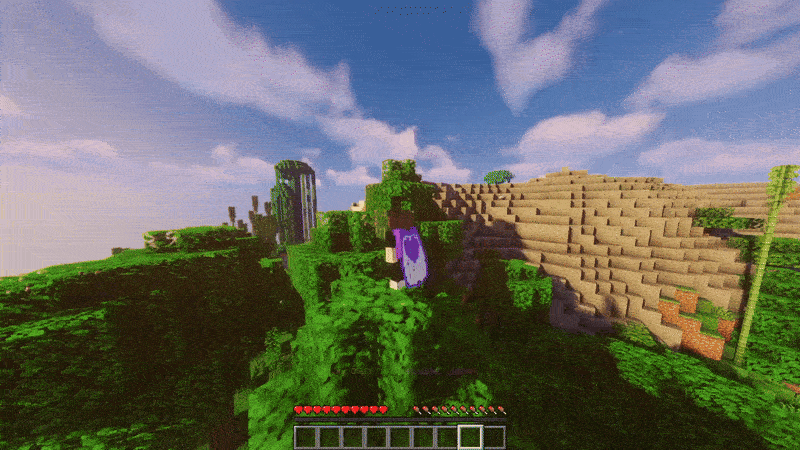
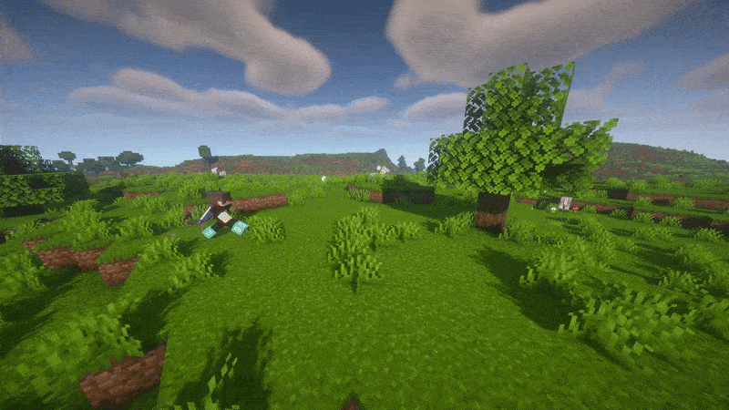
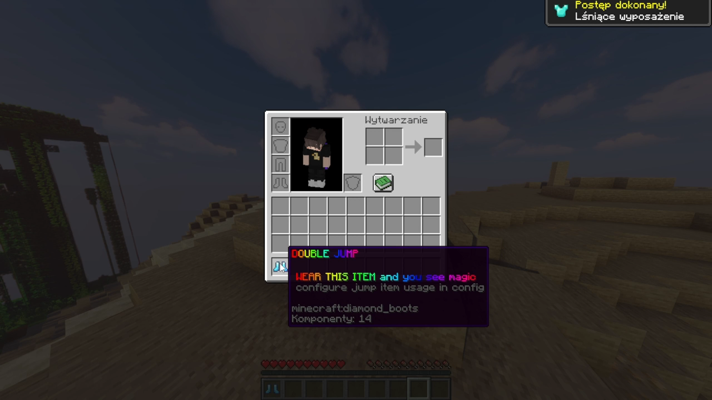

# 🚀 DoubleJump — Advanced Double Jump Plugin

> **Smooth, fully customizable double jump — predictable, stable, and lag-free.**

---

## ✨ Features

### ⚡ Clean & Predictable Mechanics
- Fully custom double jump system (not based on vanilla)
- Consistent movement without desync
- No random glitches or unexpected behavior

---

### 🎒 Jump Items
Flexible ways to activate double jump:
- `WEAR_ITEM` – wear specific boots  
- `HOLD_ITEM` – hold an item  
- `HAVE_ITEM` – keep item in inventory  
- `CLICK_ITEM` – trigger on right-click  

Each mode is fully configurable per item.

---

### 🎨 Effects Customization
- Particles and sounds on jump  
- Permission-based overrides  
- Fine-grained control for different player groups  

---

### 🔐 Permission-Based Control
Control everything via permissions:
- velocity  
- cooldown  
- effects  
- access  

Perfect for rank-based servers.

---

### 🛡️ Smart Restrictions
Disable or limit jumping in specific scenarios:
- Elytra equipped  
- Selected worlds  
- WorldGuard regions  
- Combat (EternalCombat support)  
- High-ping players  
- Or allow only via permission  

---

### ⏱️ Cooldown System
- Limit jump usage (e.g. every X seconds)  
- Prevent spam and abuse  

---

### 💥 Fall Damage Control
- Disable for parkour or fun modes  
- Enable for balanced PvP  

---

### 🔄 Auto Enable
- Automatically enable on join  
- Optional permission-based activation (e.g. VIP)  

---

### ⚙️ Fully Configurable
- Messages  
- Mechanics  
- Conditions  
- Visuals  

No hardcoded limitations.

---

### 🚀 Performance
- Optimized for high-performance servers  
- Minimal overhead  
- Scales well with large player counts  

---

## 🖼️ Showcase

🎬 Real gameplay — no tricks.

  
  
  
  

---

## 💻 Commands & Permissions

| Command                   | Permission                  | Description                |
|---------------------------|-----------------------------|----------------------------|
| `/doublejump enable`      | `command.doublejump`        | Enable for yourself        |
| `/doublejump disable`     | `command.doublejump`        | Disable for yourself       |
| `/doublejump enable-for`  | `command.doublejump.target` | Enable for another player  | 
| `/doublejump disable-for` | `command.doublejump.target` | Disable for another player | 
| `/doublejump item give`   | `command.doublejump.item`   | Give jump item             |
| `/doublejump item remove` | `command.doublejump.item`   | Remove jump item           |
| `/doublejump reload`      | `command.doublejump.reload` | Reload config              |

---

## 🛒 Support & Refunds

💬 Discord: `imdmk`

Refunds are provided only if:
- A critical bug breaks core functionality  
- The issue cannot be resolved in a reasonable time  

---

## 🌟 Why DoubleJump?

Most plugins:
- glitch  
- are limited  
- or impact performance  

**This one focuses on stability, control, and clean design.**

You get:
- reliable mechanics  
- full configurability  
- predictable behavior  

---

## ❤️ Support

⭐ Leave a star  
☕ Donate: https://paypal.me/dominiksuliga  

---

## 💡 Summary

If you want a **stable, configurable double jump system that just works**, this is it.
